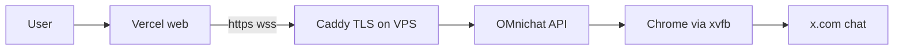

# VPS deploy — Oracle Always Free + Vercel web

Run the **always-on API** (WebSockets, Twitch/Kick ingest, X scrape, Rumble SSE chat) on a VPS.  
Host the **website** on Vercel (free). Your PC can stay off.



## Phase 1 — Code (done in repo)

- `X_SCRAPE_HEADLESS=0` + `xvfb` → real (headed) Chrome on Linux
- `X_SCRAPE_HEADLESS=1` (default) → headless for local dev

## Phase 2 — Oracle Cloud VM

1. Sign up at [cloud.oracle.com](https://cloud.oracle.com) (card verification only on free tier).
2. **Create VM:**
   - Shape: **VM.Standard.A1.Flex** (Always Free ARM)
   - OCPUs: 2, Memory: 12 GB (or max free)
   - Image: **Ubuntu 22.04 Minimal (aarch64)** — not Oracle Linux
   - Add SSH key
3. If **Out of capacity**: try another region / availability domain, or retry later. Fallback: Hetzner CX22 (~€4/mo) — same scripts work.
4. **VCN security list** (Networking → Virtual cloud networks → your VCN → Security lists):
   - Ingress: TCP **22**, **80**, **443** from `0.0.0.0/0`
5. Note the **public IP**.

## Phase 3 — DNS (free hostname)

1. [duckdns.org](https://www.duckdns.org) → create subdomain e.g. `omnichat-api.duckdns.org` → point to VPS IP.
2. Use this as `API_PUBLIC_URL` and Caddy domain.

## Phase 4 — Bootstrap the VPS

SSH in as `ubuntu` (or your user):

```bash
# Clone (or scp your repo)
sudo mkdir -p /opt/om-nichat
sudo chown "$USER:$USER" /opt/om-nichat
git clone https://github.com/YOUR/om-nichat.git /opt/om-nichat
cd /opt/om-nichat

# System deps + firewall
sudo bash deploy/vps/install-deps.sh

# Build API + Playwright Chromium
bash deploy/vps/build-api.sh

# Configure env
cp deploy/vps/env.example .env
nano .env   # fill X_AUTH_TOKEN, X_CT0, secrets, URLs

# TLS reverse proxy (Let's Encrypt via Caddy)
sudo bash deploy/vps/setup-caddy.sh omnichat-api.duckdns.org

# systemd service (xvfb + API)
sudo bash deploy/vps/install-services.sh /opt/om-nichat
```

### X session cookies

On your PC (Chrome, logged into X):

1. DevTools → Application → Cookies → `https://x.com`
2. Copy `auth_token` and `ct0` into VPS `.env`
3. `sudo systemctl restart omnichat-api`

Or run locally once: `pnpm capture:x-session` and copy values to the VPS `.env`.

### Verify API

```bash
curl -s http://127.0.0.1:8787/health | jq
curl -s https://omnichat-api.duckdns.org/health | jq
```

Expect: `xServerScrape: true`, `rumbleServerIngest: true`, `xIngest` with handles, `storage: "local"` if `USE_LOCAL_DB=1`.

## Phase 5 — Vercel (web only)

Deploy **only** `apps/web` to Vercel. Do **not** rely on Vercel for the API (no WebSockets / no X scrape loop).

1. [vercel.com/new](https://vercel.com/new) → import repo → **Root Directory:** `apps/web`
2. Environment variable:

   | Name | Value |
   |------|--------|
   | `NEXT_PUBLIC_API_URL` | `https://omnichat-api.duckdns.org` |

3. Deploy.

From Windows (repo root), after `vercel link` on web project:

```powershell
.\scripts\vercel-web-vps.ps1 -ApiUrl "https://omnichat-api.duckdns.org"
```

4. Update OAuth developer consoles — callbacks must use the **VPS** host:

   ```
   https://omnichat-api.duckdns.org/auth/twitch/callback
   https://omnichat-api.duckdns.org/auth/kick/callback
   https://omnichat-api.duckdns.org/auth/x/callback
   ```

5. Set matching values in VPS `.env` and restart API.

## Phase 6 — End-to-end test

1. Open Vercel web URL → log in
2. Settings → Channels → add an X handle (e.g. `@xqc`)
3. When that account is live, chat should appear in `/chat`
4. **Turn off your PC** — VPS keeps scraping

## Operations

| Task | Command |
|------|---------|
| Logs | `journalctl -u omnichat-api -f` |
| Restart API | `sudo systemctl restart omnichat-api` |
| Update code | `cd /opt/om-nichat && git pull && bash deploy/vps/build-api.sh && sudo systemctl restart omnichat-api` |
| Refresh X cookies | Edit `.env`, restart service |

## Risks

- Datacenter IP may trigger X login challenges — re-export cookies; consider residential proxy if blocked.
- Oracle free ARM capacity varies by region.
- Keep `auth_token` / `ct0` secret — treat `.env` like a password.

## Files in repo

| File | Purpose |
|------|---------|
| [deploy/vps/install-deps.sh](../deploy/vps/install-deps.sh) | Node, pnpm, xvfb, ufw |
| [deploy/vps/build-api.sh](../deploy/vps/build-api.sh) | pnpm build + Playwright |
| [deploy/vps/env.example](../deploy/vps/env.example) | VPS `.env` template |
| [deploy/vps/setup-caddy.sh](../deploy/vps/setup-caddy.sh) | HTTPS/WSS TLS |
| [deploy/vps/install-services.sh](../deploy/vps/install-services.sh) | systemd unit |
| [docs/X-SERVER-SCRAPE.md](./X-SERVER-SCRAPE.md) | X scrape details |
| [docs/RUMBLE-SERVER-INGEST.md](./RUMBLE-SERVER-INGEST.md) | Rumble watch + send |
