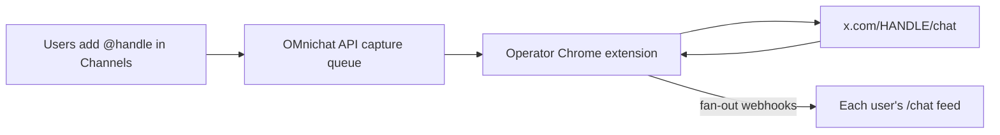
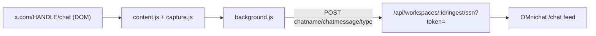

# OMnichat X Live Capture (Chrome extension)

X (Twitter) has no public live-chat API, so this extension reads the live chat
that is already rendered in your logged-in browser on `x.com/HANDLE/chat` and
forwards each message to your OMnichat ingest webhook.

## Operator mode (recommended for hosted OMnichat)

**One install on the operator's machine — end users never install anything.**

1. Log into OMnichat as **super admin** (`SUPER_ADMIN_EMAILS` in `.env`)
2. Open **Settings → Connections** or `/admin` → **Generate operator pairing code**
3. Load this extension in Chrome (logged into X)
4. Popup → **Operator (all users)** → paste code → **Pair**
5. Users add X handles under **Settings → Channels** — the extension polls the API every ~1 min, opens live chat tabs, and routes messages to each workspace that requested that handle



## Single-workspace mode (legacy)

Pair with a per-workspace code from **Settings → Connections** using **Single workspace** mode.



## Files

| File | Purpose |
|------|---------|
| `manifest.json` | MV3 manifest (content script on x.com, popup, background worker) |
| `capture.js` | Pure, testable DOM extraction (`globalThis.OmniXCapture`) |
| `content.js` | Observes the chat DOM, dedupes, relays to the background worker |
| `background.js` | POSTs messages to the webhook, tracks send status |
| `popup.html` / `popup.js` | Config UI: webhook URL, enable toggle, test button, status |
| `test-fixture.html` | Local DOM test for `capture.js` without visiting x.com |

## Pair with OMnichat

**Operator (all users):** super admin → `/admin` or Settings → Connections → generate operator code.

**Single workspace:** Settings → Connections → generate pairing code (workspace mode in popup).

Add X handles under **Settings → Channels** so the feed shows them on a matching tab.

## Test it within Cursor (local dev)

1. Start the stack from the repo root:
   - `pnpm dev:api` (API on `http://localhost:8787`)
   - `pnpm dev:web` (web on `http://localhost:3000`)
2. Test the DOM parser without x.com:
   - Open `extensions/chrome/test-fixture.html` in Chrome
   - Click **Run extract()** and confirm the assertions show **PASS**
3. Load the extension:
   - Go to `chrome://extensions`
   - Toggle **Developer mode** on (top right)
   - Click **Load unpacked** and select the `extensions/chrome` folder
4. Configure + verify end-to-end:
   - Click the extension icon to open the popup
   - Paste the **Webhook URL**, tick **Capture enabled**, click **Save**
   - Click **Send test message** — it should report "Test message sent"
   - Confirm the message appears in OMnichat `/chat` on the X tab
5. Capture a real stream:
   - Open `x.com/HANDLE/chat` while the stream is live
   - Messages stream into OMnichat automatically

> Note: the default `host_permissions` only cover `localhost:8787` / `127.0.0.1:8787`.
> To use a production webhook, add your API domain (e.g. `https://api.yourdomain.com/*`)
> to `host_permissions` in `manifest.json` and reload the extension.

## Updating selectors when capture breaks

X changes its DOM periodically. When messages stop flowing, update the selector
arrays at the top of `capture.js` (`MESSAGE_CONTAINER_SELECTORS`, `TEXT_SELECTORS`,
`AUTHOR_SELECTORS`), then re-run `test-fixture.html` and reload the extension.

## Publish to the Chrome Web Store

1. **Prerequisites**
   - A Google account and a one-time **$5** developer registration at the
     [Chrome Web Store Developer Dashboard](https://chrome.google.com/webstore/devconsole)
   - A 128×128 PNG icon (and optionally 16/32/48 px). Add them to the folder and
     reference them in `manifest.json`:
     ```json
     "icons": { "16": "icons/16.png", "48": "icons/48.png", "128": "icons/128.png" },
     "action": { "default_icon": { "16": "icons/16.png", "48": "icons/48.png", "128": "icons/128.png" }, "default_popup": "popup.html" }
     ```
   - At least one 1280×800 or 640×400 screenshot for the listing
2. **Lock down host permissions**
   - Replace the localhost entries with your production API domain only, e.g.
     `"host_permissions": ["https://api.yourdomain.com/*"]`. Broad patterns like
     `https://*/*` trigger extra review and are likely to be rejected.
3. **Bump the version**
   - Increment `"version"` in `manifest.json` for every upload
4. **Zip the package**
   - Zip the **contents** of `extensions/chrome` (not the parent folder) so
     `manifest.json` is at the root of the archive:
     - PowerShell: `Compress-Archive -Path extensions/chrome/* -DestinationPath omnichat-x-capture.zip`
5. **Create the listing**
   - Dashboard → **Add new item** → upload the zip
   - Fill in description, category (Communication/Social), language, screenshots
   - **Privacy practices**: declare that the extension reads page content on x.com
     and transmits chat messages to the user-configured OMnichat endpoint. Provide
     a privacy policy URL. Justify the `storage` permission (saving the webhook URL)
     and each host permission (sending captured messages to your API).
6. **Submit for review**
   - Reviews typically take a few business days. Address any policy feedback and
     re-submit with a bumped version if needed.

### Distribution alternatives

- **Unlisted**: publish but hide from search — share the direct store link with users.
- **Private (Trusted Testers)**: restrict to specific Google accounts during testing.
- **Self-hosted / load unpacked**: skip the store entirely for internal use, but
  users must enable Developer mode and re-load after updates.

## Limitations

- Read-only: this captures chat into OMnichat; it does not send messages to X.
- Requires the user to keep the `x.com/HANDLE/chat` tab open while live.
- Scraping the X DOM is against X's Terms of Service; ship and use at your own risk.
